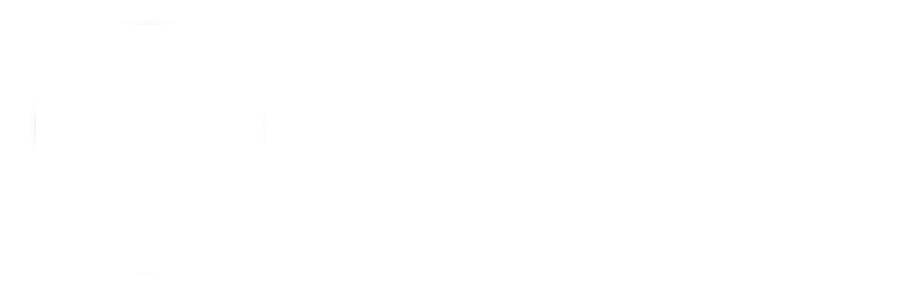

# RTZ New Frontend



This is the new frontend to the RTZ (pronounced Routes) project. It is a fork of the [new comma connect frontend](https://github.com/commaai/new-connect) with some changes to update dependencies and enable its usage in RTZ.

> [!WARNING]
> This is not the production frontend, you probably want to use the [RTZ Frontend](https://github.com/USA-RedDragon/rtz-frontend).

## Changes from upstream

- Installed Renovate to keep dependencies up to date
- Public Mapbox style. The styles is public at Mapbox [dark](https://api.mapbox.com/styles/v1/usa-reddragon/clyxcc7mc00st01nxh4xp4oy7.html?title=copy&access_token=pk.eyJ1IjoidXNhLXJlZGRyYWdvbiIsImEiOiJjbHdxc3AzdXEwNWJrMmpweGthNm92YXByIn0.sMNsr0rwN7bYyVn499Z7cw&zoomwheel=true&fresh=true#16.94/32.571786/-117.089917) [light](https://api.mapbox.com/styles/v1/usa-reddragon/clyxccwdz00tx01p90qa01yni.html?title=copy&access_token=pk.eyJ1IjoidXNhLXJlZGRyYWdvbiIsImEiOiJjbHdxc3AzdXEwNWJrMmpweGthNm92YXByIn0.sMNsr0rwN7bYyVn499Z7cw&zoomwheel=true&fresh=true#15.24/32.705693/-117.209988)
- Updated all dependencies to latest versions

## Development

- Install bun: <https://bun.sh>
- Install dependencies: `bun install`
- Start dev server: `bun dev --open`

For a full fresh setup in `$HOME`:

```bash
curl -fsSL https://bun.sh/install | bash

cd ~
git clone git@github.com:commaai/new-connect.git

cd new-connect
bun install
bun dev
```

## Contributing

connect has a demo mode, so no special comma device is needed to develop connect.

A few constraints to keep connect light and the dev environment fun:

- 5k line limit
- 500KB bundle size limit
- 1m timeout for all CI

References:

- [API docs](https://api.comma.ai)
- [openpilot docs](https://docs.comma.ai)
